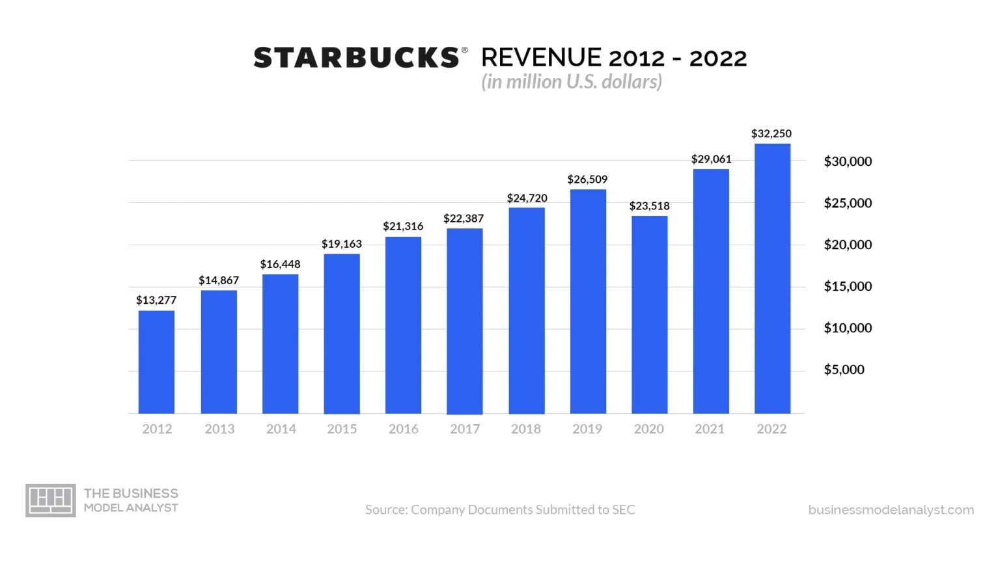

# DSC412-project
# Starbucks Sentiment Analysis Project

## Summary
This project analyzes the relationship between Starbucks' price changes, consumer sentiment scores, and revenue from 2020 to 2023. First, data related to the price changes is collected from Twitter and Reddit using their respective APIs. Sentiment analysis is performed on the collected data to compute sentiment scores by using 3 methods. Then, statistical analyses are conducted to examine the correlation between these sentiment scores and revenue. The findings will provide insights into how price changes impact consumer sentiment and sales performance. 

## Files
- `code.ipynb`: The main notebook containing all code for data collection, processing, and analysis.
- `starbucks_opinions_{year}.txt`: Files with user opinions extracted from social media for each year, formatted for sentiment analysis.

## Requirements
The project requires Python 3.8 or 3.9 due to compatibility with specific libraries. All required packages are listed in `requirements.txt`.

## How to Run
1. **Set Up Environment**  
   Install the required packages by running:
   ```bash
   pip install -r requirements.txt

2. **Run Notebooks**
    Open code.ipynb in VS code.
    Execute each cell sequentially to complete the analysis.
    Ensure that the data files (starbucks_opinions_{year}.txt) are in the same directory as the notebook.


## Data Information

Negative comment of starbucks price increase
https://www.reddit.com/r/starbucks/comments/1bta4eh/starbucks_raising_price_almost_every_month_now/

Starbucks Revenue 2012-2022

https://businessmodelanalyst.com/is-starbucks-profitable/

US inflation rate
https://www.investopedia.com/inflation-rate-by-year-7253832

Train Data
I tried to find some data for trainging in Kaggle, but there is only sentiment data for bitcoin or something involved in economics. I thought the market of bitcoin and coffee is totally different, so I asked chat gpt to make training sentiment dataset of Starbucks price increase. 


Precaution
I tried to compare the R-squared values for each model, but at some point, the print function stopped working.
